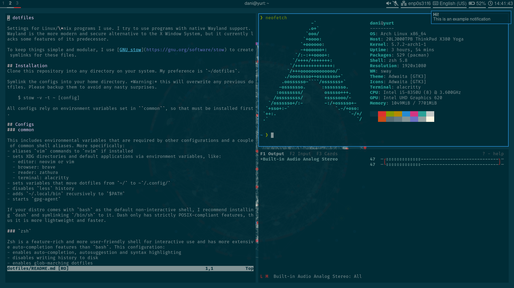

# dotfiles

Settings for Linux/\*nix programs I use. I try to use programs with native Wayland support. Wayland is the more modern and secure alternative to the X Window System, but it currently lacks some features of its predecessor.

To keep things simple and modular, I use [GNU stow](https://gnu.org/software/stow) to create symlinks for these files.

## Installation
Clone this repository into any directory on your system. My preference is `~/dotfiles`.

Symlink the configs into your home directory. *Warning:* this will overwrite any previous dotfiles. Please backup them to avoid any nasty surprises.

    $ stow -v -t ~ [config]

All configs rely on environment variables set in ``common``, so that must be installed first.

## Configs
### common

This includes environmental variables that are required by other configurations and a couple of common shell aliases. More specifically:
- aliases `vim` commands to `nvim` if installed
- sets XDG directories and default applications via environment variables, like:
  - editor: neovim or vim
  - browser: brave
  - reader: zathura
  - terminal: alacritty
- sets variables that move dotfiles from `~/` to ~`/.config/`
- disables `less` history
- adds `~/.local/bin` recursively to `$PATH`
- starts `gpg-agent`
- automatically launches sway on TTY1

If your distro comes with `bash` as the default non-interactive shell, I recommend installing `dash` and symlinking `/bin/sh` to it. Dash only has strictly POSIX-compliant features, thus it is more lightweight and faster.

### `zsh`

Zsh is a feature-rich and more user-friendly shell for interactive use and has more extensive auto-completion features than `bash`. This configuration:
- enables auto-completion, autosuggestion and syntax highlighting
- disables writing history to disk
- enables glob-marching dotfiles
- sets the gorgeous [`powerlevel10k`](https://github.com/romkatv/powerlevel10k) for its prompt
- sets the terminal title to the currently running program
- automatically refreshes completion if a new program was installed. You need to set up a [pacman hook](https://wiki.archlinux.org/index.php/zsh#On-demand_rehash).
- enables a command not found handler that searches packages in the official repository for the command. You need to update its cache with `pkgfile -u` (as root) first.

#### Dependencies:
    # pacman -S zsh zsh-syntax-highlighting zsh-autosuggestions zsh-theme-powerlevel10k pkgfile

### sway

[Sway](https://github.com/swaywm/sway) is an`i3`-like window manager for Wayland. The default keybindings remain unchanged, but a subset of [Luke Smith's tweaks](https://github.com/LukeSmithXyz/voidrice/) are added, including:
- menu for launching graphical and terminal programs (using `wofi`)
- volume setting via media keys (using `pactl`, comes by default with `pulse`)
- visual volume adjustment (using `pulsemixer`)
- taking screenshot of whole screen, window or selected area (using a modified `grimshot`, `.local/bin/grimshot`). Bindings follow [Gnome's default shortcuts](https://help.gnome.org/users/gnome-help/stable/screen-shot-record.html.en).
- changing brightness (using `light`)
- toggling WLAN and Bluetooth (using the custom `.local/bin/rfkill-toggle`)
- toggling keyboard backlight (using the custom `.local/bin/kbdbacklight`)
- keybindings for shutdown, reboot and hibernate (using `systemd`)
- a script for querying/monitoring keyboard layout changes (`.local/bin/kbdlayout`), used by waybar
- automatic screen locking and lockscreen
- polkit authentication agent

A custom theme is set (see the screenshot). On Arch and Void Linux systems, the wallpaper is automatically generated from the graph of installed packages, if the `arch` directory is `stow`ed.

#### Dependencies
    # pacman -S sway swaybg swayidle swaylock wofi pulseaudio pulsemixer grim slurp wl-clipboard jq util-linux light dbus ttf-fira-code polkit-gnome

### Neovim

An extensive and very powerful text editor. Currently, most settings are kept unchanged, but a large number of useful plugins are included.

#### Dependencies

    # pacman -S neovim vim-airline vim-airline-themes vim-surround vim-nerdtree vim-editorconfig

From the AUR, get:
- vim-colors-solarized-git
- vim-rainbow-parentheses-git

### Waybar

A graphical statusbar natively compatible with Wayland. Right-to-left, it displays:
- workspaces, active binding mode and title of the focused window on Sway
- any system tray icons
- speaker and microphone volume, click to open `pulsemixer`
- active network connection, hover for more info, click to open `nmtui`
- active keyboard layout (via  custom `.local/bin/kbdlayout`)
- battery status and warns you if it's running low, hover to show time to empty/charge
- time, click to show date, hover to show calendar, right click to open `calcurse`

If you are not using sway, you need to edit `.config/waybar/config` to remove references to the sway-specific `float-run` script.

Font Awesome is used for the icons and a custom theme is provided.

#### Dependencies
    # pacman -S waybar ttf-font-awesome

### Alacritty

A GPU-accelerated cross-platform terminal emulator. Aside from my preferred font (Fira Code)/color scheme (Solarized Dark), most settings are kept default. A script `.local/bin/xterm` is included that notifies you if an application tries to run `xterm` and launches Alacritty.

### redshift

Control the display's color temperature. Automatically sets a warmer temperature at night, reducing eye strain. Requires a version patched with Wayland support (i.e. `redshift-wayland-git` from AUR). Set to be run on login by sway.

### mako

Display desktop notifications. It is automatically added to be launched by sway on startup. Custom theming is added.

#### Dependencies

    # pacman -S mako libnotify

### gpg

A hardened configuration for the GPG encryption/signing tool. `gpg-agent` is configured, allowing for SSH connections using GPG keys.

### arch

Configurations specific to Arch Linux. I try to make everything generic, but some are possible only this way:
- wallpaper autogeneration with [`pacwall`](https://github.com/Kharacternyk/pacwall), depicting the dependency graph of the installed packages. Sway prints an intrusive error message if its output wasn't found, and I don't want to break other distros.

#### Dependencies
Get `pacwall` from AUR.

### thinkpad

These configs are specific to **my** laptop. Settings are:
- `us`/`us-intl`/`hu` keyboard layout
- Switch layouts with `Alt`+`Shift`
- Swap `CapsLock` and `Esc` keys
- Enable tap to click, disable touchpad while typing
- Automatically rotate the screen
- On-screen keyboard (requires sway 1.5 for activation)

#### dependencies
Get `rot8-git` from AUR.
